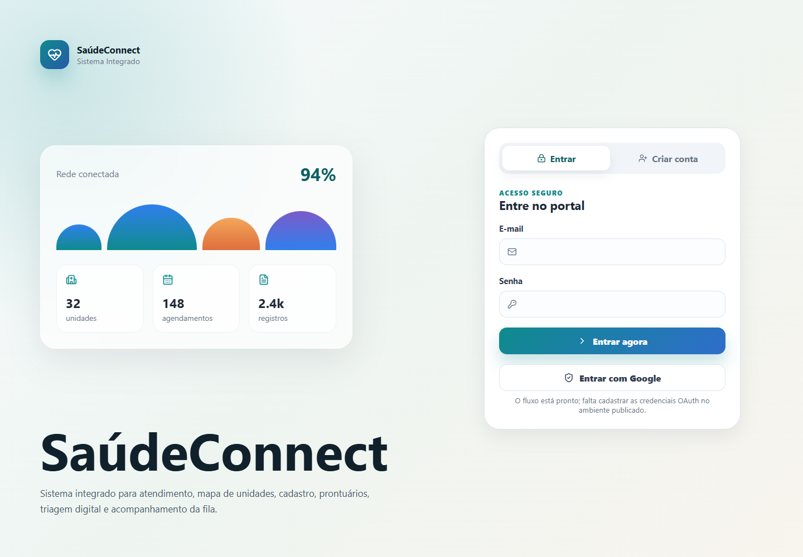
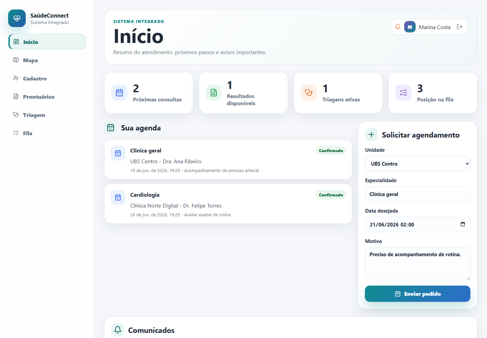
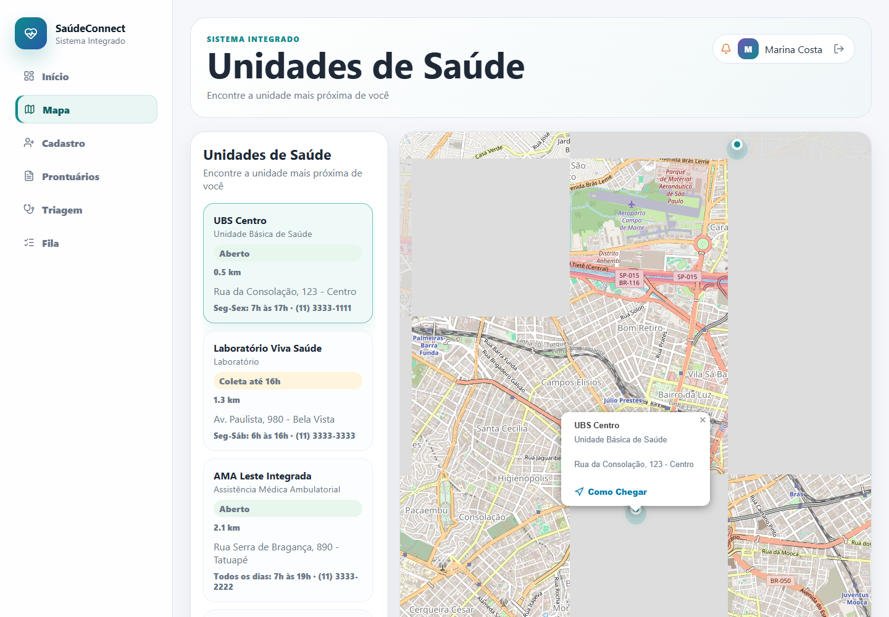
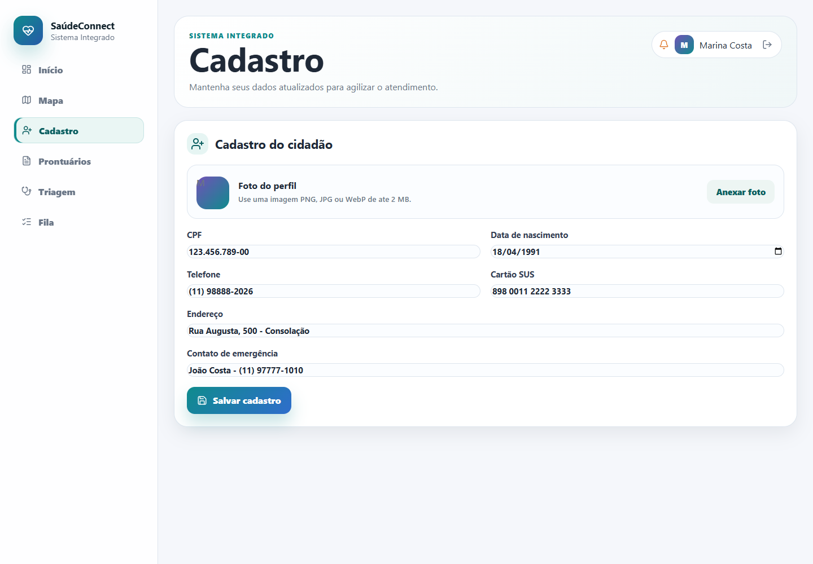
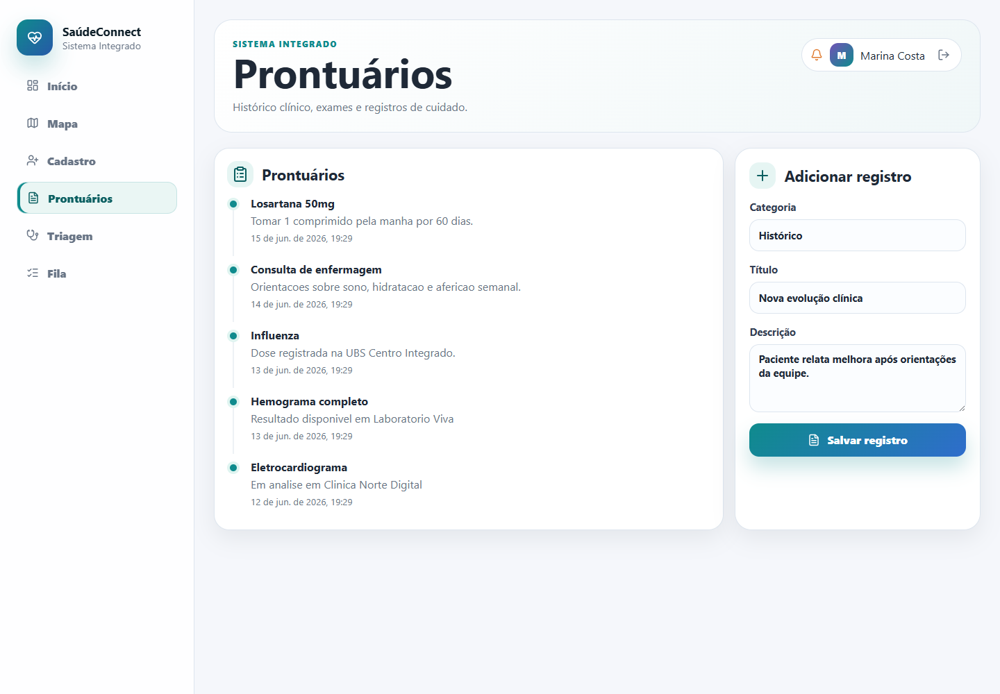
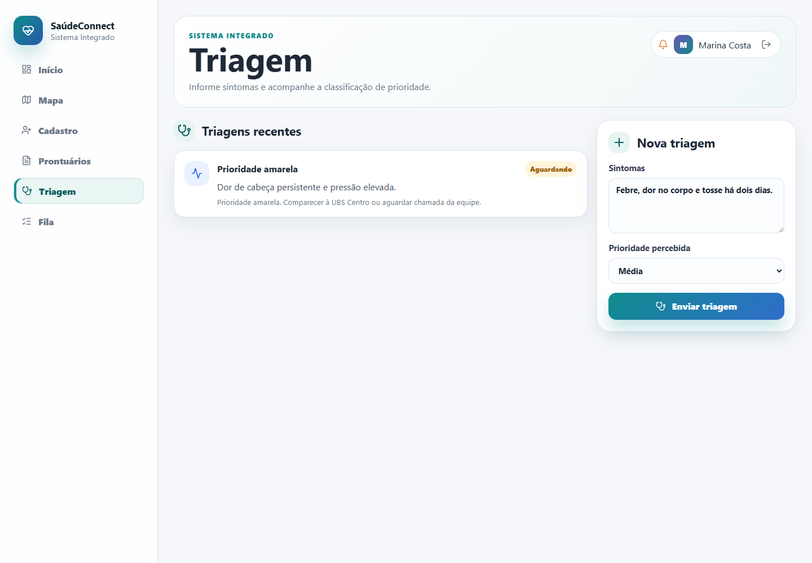
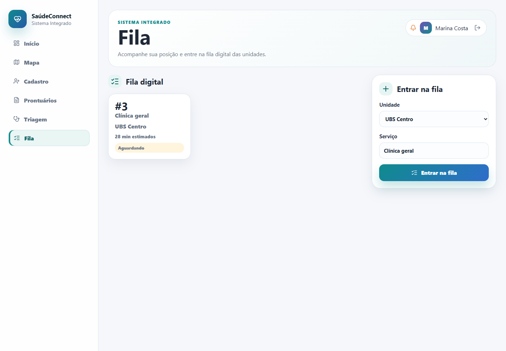
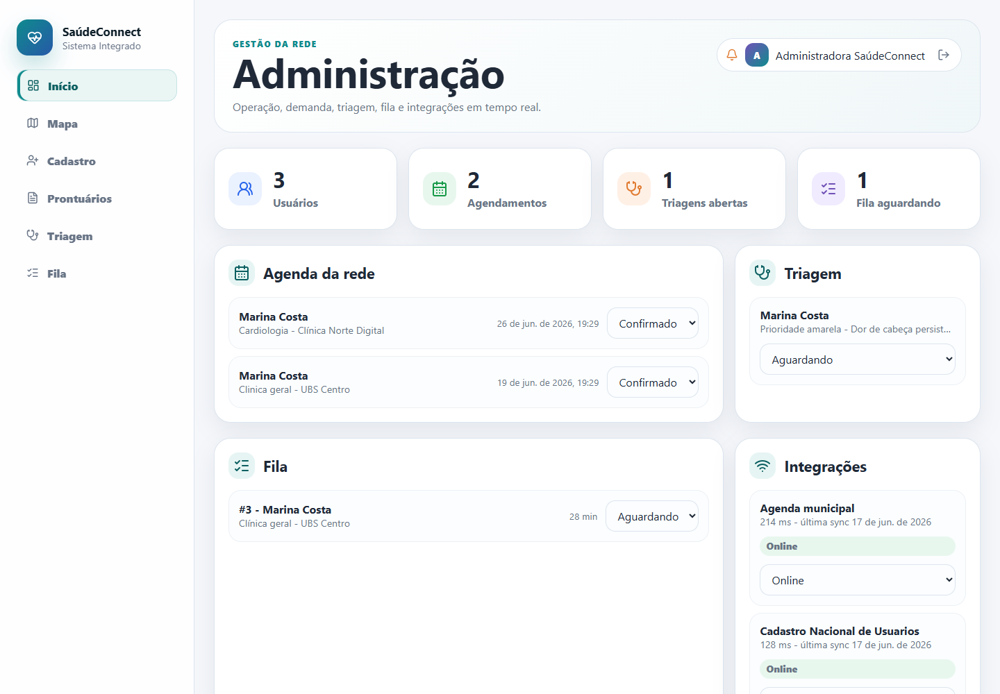

# SaúdeConnect

[](https://react.dev/)
[](https://nodejs.org/)
[](https://saudeconnectl.vercel.app)
[](https://huggingface.co/spaces/Joaoemanuel2666/SaudeConnect-Web)
[](#autenticacao-e-seguranca)

Aplicação full-stack para integração em saúde, com portal do paciente, painel administrativo, mapa interativo, API segura e versão Android via Capacitor.

## O que foi implementado

- Front-end React responsivo para celular, tablet e desktop.
- Login, cadastro e sessao JWT.
- Suporte a Google OAuth quando credenciais forem configuradas no ambiente.
- Separacao entre usuario comum e administrador.
- Portal do paciente com Início, Mapa, Cadastro, Prontuários, Triagem e Fila.
- Cadastro com upload de foto de perfil do cidadão.
- Mapa gratuito com OpenStreetMap e Leaflet.
- Painel admin com usuarios, agendamentos, triagem, fila, integrações e auditoria.
- API Node/Express com validacao, rate limit, Helmet, CORS e banco SQLite.
- Dados iniciais para testar o produto imediatamente.
- PWA manifest e projeto Android gerado com Capacitor.

## Capturas do sistema

| Login | Inicio |
| --- | --- |
|  |  |

| Mapa | Cadastro |
| --- | --- |
|  |  |

| Prontuarios | Triagem |
| --- | --- |
|  |  |

| Fila | Administracao |
| --- | --- |
|  |  |

As imagens de celular prontas para a Play Store ficam em `store-assets/google-play`.

Arquivo editavel no Figma:

```txt
https://www.figma.com/design/kzGAK3I48gMUbqezc1fbdk
```

## Tecnologias

- React 19, TypeScript, Vite e React Router.
- Node.js, Express, SQLite via better-sqlite3.
- JWT, bcryptjs, zod, Helmet e express-rate-limit.
- Capacitor Android para empacotamento mobile.
- Puppeteer Core para smoke test visual local.

## Autenticacao e seguranca

O projeto nao depende de Supabase. Ele usa um sistema de autenticacao proprio no back-end, com comportamento semelhante ao que um BaaS oferece para este caso:

- Cadastro por e-mail e senha com validacao de senha forte.
- Senhas criptografadas com `bcryptjs`; a senha original nunca e salva.
- Login local com JWT assinado por `JWT_SECRET`.
- Sessao registrada no banco em `auth_sessions`, com `jti`, data de expiracao, IP e user-agent.
- Logout com revogacao da sessao no servidor.
- Google OAuth funcional para criar usuario comum automaticamente no primeiro acesso.
- Separacao de permissoes por `role`, mantendo a area admin protegida por `adminRequired`.
- Rate limit, Helmet, CORS configuravel e validacao de entrada com `zod`.

Para producao, configure um `JWT_SECRET` forte, mantenha `GOOGLE_CLIENT_SECRET` como segredo do ambiente e use armazenamento persistente em `DATA_DIR`.

As fotos de perfil enviadas pelos usuários ficam em `DATA_DIR/uploads/avatars` e são servidas pela rota `/uploads`.

## Rodar localmente

```bash
npm install
npm run build
npm run start
```

A aplicacao fica em:

```txt
http://localhost:3001
```

Para desenvolvimento com hot reload:

```bash
npm run dev
```

## Variaveis de ambiente

Copie `.env.example` para `.env` se quiser configurar segredos reais.

```txt
PORT=3001
JWT_SECRET=troque-este-segredo
JWT_TTL=7d
DATA_DIR=./data
CLIENT_ORIGIN=http://localhost:5173,http://localhost:3001
CLIENT_URL=http://localhost:5173
GOOGLE_CLIENT_ID=
GOOGLE_CLIENT_SECRET=
GOOGLE_CALLBACK_URL=http://localhost:3001/api/auth/google/callback
```

Para ativar login Google, crie credenciais OAuth no Google Cloud Console e preencha `GOOGLE_CLIENT_ID`, `GOOGLE_CLIENT_SECRET` e `GOOGLE_CALLBACK_URL`.

## Testes e verificacao

Build web:

```bash
npm run build
```

Smoke test visual:

```bash
node scripts/smoke-visual.mjs
```

As capturas ficam em:

```txt
artifacts/screenshots
```

## Publicacao na Vercel

O projeto inclui `vercel.json` e uma funcao serverless em `api/[...path].js`. Para publicar:

```bash
vercel --prod
```

Variaveis de producao necessarias:

```txt
JWT_SECRET=um-segredo-longo-e-aleatorio
JWT_TTL=7d
CLIENT_URL=https://saudeconnectl.vercel.app
CLIENT_ORIGIN=https://saudeconnectl.vercel.app
GOOGLE_CLIENT_ID=seu-client-id-google
GOOGLE_CLIENT_SECRET=seu-client-secret-google
GOOGLE_CALLBACK_URL=https://saudeconnectl.vercel.app/api/auth/google/callback
```

No cliente OAuth do Google, autorize:

```txt
Origem JavaScript: https://saudeconnectl.vercel.app
URI de redirecionamento: https://saudeconnectl.vercel.app/api/auth/google/callback
```

Na Vercel, o SQLite e os uploads usam o diretorio temporario da funcao. Isso atende a demonstracao; para dados permanentes em producao, conecte um banco gerenciado e armazenamento de arquivos persistente.

## Publicação no Hugging Face Spaces

Este projeto já inclui `Dockerfile` e metadados no README para rodar como Docker Space.

Também há um workflow em `.github/workflows/deploy-huggingface.yml`. Para publicar pelo GitHub:

1. Crie um token no Hugging Face com permissão de escrita.
2. No GitHub, adicione esse token em `Settings > Secrets and variables > Actions > Secrets` com o nome `HF_TOKEN`.
3. Opcionalmente, adicione a variável `HF_SPACE_ID` com `Joaoemanuel2666/SaudeConnect-Web`.
4. Execute o workflow `Deploy Hugging Face Space`.

Variáveis recomendadas no Space:

```txt
PORT=7860
JWT_SECRET=troque-este-segredo
CLIENT_URL=https://joaoemanuel2666-saudeconnect-web.hf.space
CLIENT_ORIGIN=https://joaoemanuel2666-saudeconnect-web.hf.space
GOOGLE_CLIENT_ID=seu-client-id-google
GOOGLE_CLIENT_SECRET=seu-client-secret-google
GOOGLE_CALLBACK_URL=https://joaoemanuel2666-saudeconnect-web.hf.space/api/auth/google/callback
```

No Google Cloud Console, adicione este redirect URI:

```txt
https://joaoemanuel2666-saudeconnect-web.hf.space/api/auth/google/callback
```

## Demo online

Versao principal publicada na Vercel:

```txt
https://saudeconnectl.vercel.app
```

Versao alternativa no Hugging Face Spaces:

```txt
https://joaoemanuel2666-saudeconnect-web.hf.space
```

Repositorio do Space:

```txt
https://huggingface.co/spaces/Joaoemanuel2666/SaudeConnect-Web
```

## Android APK

O projeto Android ja foi criado em `android/`.

APK demo gerado:

```txt
artifacts/SaudeConnect-demo-debug.apk
```

Esse APK foi compilado com:

```txt
VITE_API_URL=https://joaoemanuel2666-saudeconnect-web.hf.space/api
```

Logo, ele autentica e carrega dados enquanto a demo do Hugging Face estiver online.

Para gerar outro APK:

```powershell
$env:JAVA_HOME='C:\Program Files\Eclipse Adoptium\jdk-25.0.1.8-hotspot'
$env:Path="$env:JAVA_HOME\bin;$env:Path"
$env:VITE_API_URL='https://sua-api-publica.com/api'
npm run mobile:apk
```

O APK fica em:

```txt
android/app/build/outputs/apk/debug/app-debug.apk
```

Para release de producao, configure assinatura Android, gere `assembleRelease` e use uma API HTTPS permanente.
